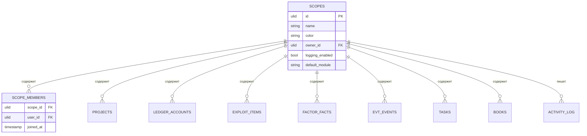
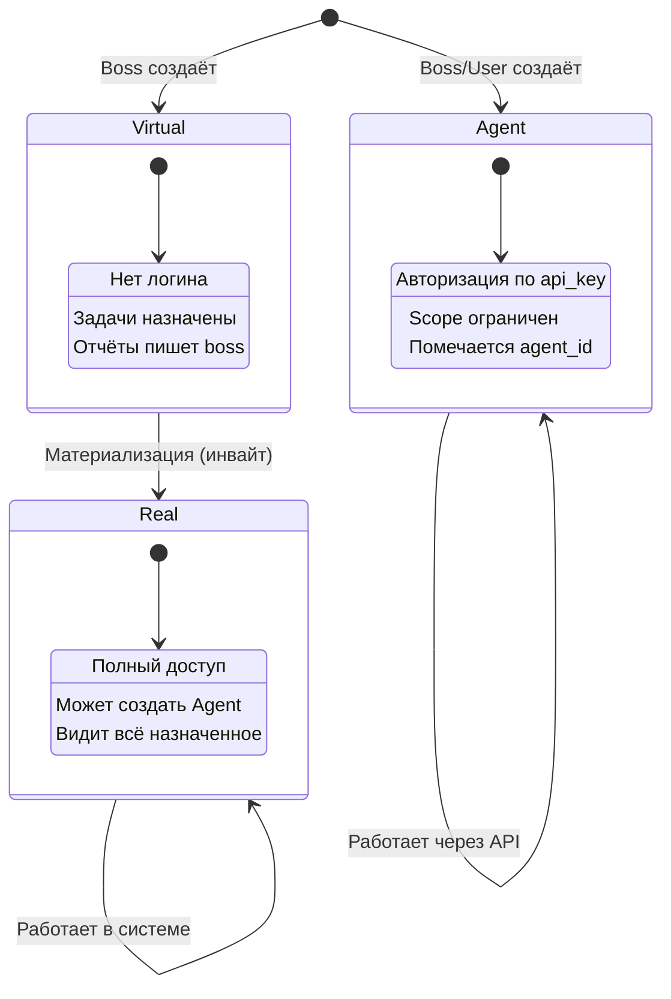
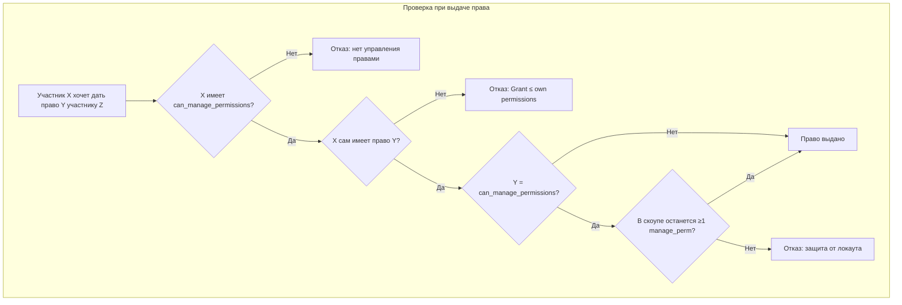
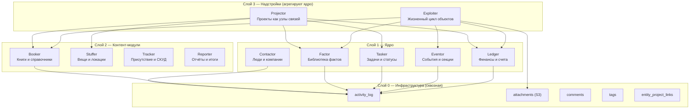
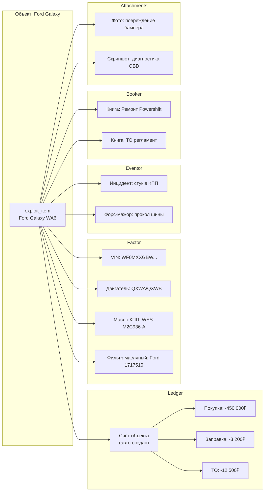
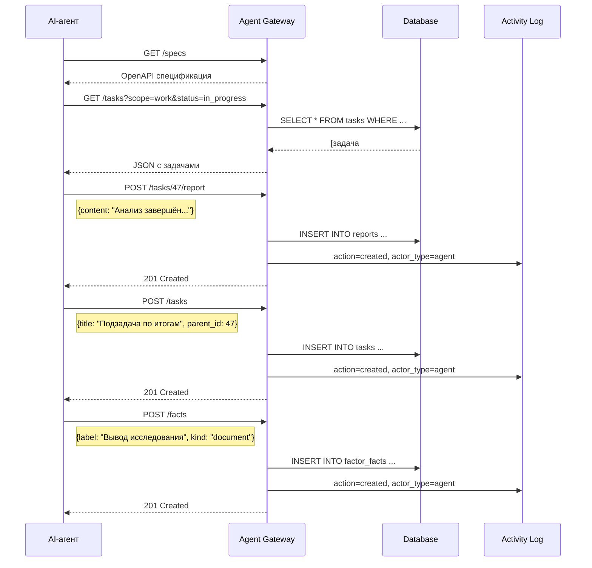
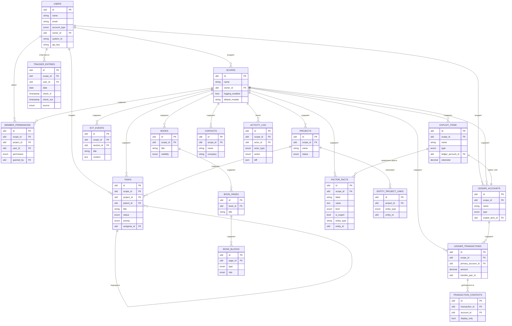

# Telefront v2 — Архитектурная документация

> Версия: 0.1-draft · Дата: 2026-08-25
> Статус: Концептуальный дизайн, готовность к прототипированию

---

## 1. Введение

### 1.1. Что такое Telefront

Telefront — это закрытая многопользовательская CRM-система для управления работой и личной жизнью. Система объединяет в себе задачник, финансовый учёт, библиотеку фактов, трекер объектов реального мира, календарь событий, книги-справочники, контактную книгу и другие модули.

Ключевые принципы v2:

- **Многопользовательская среда** с гибкой системой прав на уровне чекбоксов (capability-based access control)
- **AI-ready архитектура** — агентский шлюз с OpenAPI-спецификацией, позволяющий любому AI-агенту работать с системой через API
- **Скоупы** — глобальная изоляция данных по контекстам (Работа, Личное, Подработка и т.д.)
- **Сквозное логирование** — полный аудит всех действий всех акторов
- **Проект как полиморфный узел** — связывает сущности из любых модулей

### 1.2. Чем v2 отличается от v1

| Аспект | v1 (текущая) | v2 (новая) |
|--------|-------------|------------|
| Пользователи | Один пользователь | Многопользовательская + виртуальные аккаунты |
| Изоляция данных | Нет | Скоупы (пространства контекста) |
| AI-интеграция | Нет | Агентский шлюз с OpenAPI |
| Права доступа | Нет | Capability-based с делегированием |
| Логирование | Минимальное | Полный аудит с diff |
| Файлы | Локально | S3-хранилище |
| Связи между сущностями | Через search_keywords | Явные полиморфные связи |

### 1.3. Стек технологий

**Frontend:** React, Vite, Mantine UI, Zustand, React Router, React Query, MDXEditor, Excalidraw, Recharts

**Backend:** Laravel (PHP), MariaDB/MySQL, S3-совместимое хранилище

**Идентификаторы:** ULID (26 символов, сортируемые по времени)

### 1.4. Закрытость системы

Telefront — непубличная система. Свободной регистрации нет. Пользователи добавляются исключительно по приглашению владельца скоупа. Каждый новый аккаунт проходит через цикл: виртуальный → материализация → реальный.

---

## 2. Скоупы (Пространства контекста)

### 2.1. Концепция

Скоуп — это глобальный контекст, который изолирует все данные системы. Переключение скоупа перерисовывает всё: задачи, счета, события, факты, объекты.

Примеры скоупов: «Работа», «Личное», «Подработка 1», «Подработка 2».

Одна сущность принадлежит ровно одному скоупу, за исключением кросс-скоуповых сущностей (контакты, кросс-скоуповые переводы).

### 2.2. Структура данных

```
scopes
├── id (ulid)
├── name
├── color (hex)
├── icon (optional)
├── owner_id → users.id
├── logging_enabled (bool, default: true)
├── default_module (стартовый модуль при входе)
├── created_at
└── updated_at
```

### 2.3. Диаграмма



### 2.4. Кросс-скоуповые сущности

Некоторые сущности по природе живут в нескольких скоупах:

**Контакты:** запись контакта глобальна (`scope_id = null`), а привязка к скоупу идёт через `scope_contacts (scope_id, contact_id, role, tags)`. Один человек — одна запись, видна в нескольких скоупах с разными ролями.

**Кросс-скоуповые переводы:** перевод между счетами разных скоупов порождает две транзакции (по одной в каждом скоупе), связанные через `transfer_pair_id`. Каждая транзакция живёт и видна только в своём скоупе.

### 2.5. Стартовый модуль скоупа

Каждый скоуп имеет `default_module` — модуль, который открывается первым при входе в скоуп. Для рабочего скоупа это обычно Tasker, для личного — Ledger или Eventor. Настраивается владельцем.

---

## 3. Пользователи и аккаунты

### 3.1. Типы аккаунтов

В системе четыре типа аккаунтов, все живут в одной таблице `users`:

| Тип | Описание | Аутентификация |
|-----|----------|----------------|
| `owner` | Создатель скоупа, полный контроль | Email + пароль |
| `real` | Материализованный пользователь | Email + пароль |
| `virtual` | Заглушка, созданная владельцем | Нет (не входит в систему) |
| `agent` | AI-агент | API-ключ |

### 3.2. Структура данных

```
users
├── id (ulid)
├── name
├── email (nullable для virtual)
├── password_hash (nullable для virtual и agent)
├── account_type: owner | real | virtual | agent
├── owner_id → users.id (кто создал; null для owner)
├── system_id (string, nullable — для будущей интеграции со СКУД)
├── api_key (nullable — только для agent)
├── api_key_last_used_at
├── avatar_s3_key (nullable)
├── is_active (bool)
├── created_at
└── updated_at
```

### 3.3. Жизненный цикл аккаунта



### 3.4. Материализация виртуального аккаунта

Процесс материализации:

1. Владелец создаёт виртуальный аккаунт с именем (и опционально email)
2. Владелец назначает задачи, пишет отчёты от его имени, выдаёт права на скоупы
3. Когда реальный человек готов подключиться — владелец отправляет инвайт-ссылку
4. Человек переходит по ссылке, создаёт пароль
5. `account_type` меняется на `real`, `id` остаётся прежним
6. Вся история (задачи, отчёты, права) мгновенно доступна

Важно: при материализации `id` не меняется. Все существующие связи сохраняются.

### 3.5. Агентские аккаунты

Каждый агент — это отдельный аккаунт в `users`:

- `account_type = agent`
- `owner_id` указывает на создателя (owner или real user)
- `api_key` используется для аутентификации
- Права агента не могут превышать права его владельца
- Агент работает только в скоупах, к которым у его владельца есть доступ

Любой материализованный пользователь может создать себе агента. Агент будет работать от его имени в рамках его прав.

### 3.6. Authorship (Авторство)

Во всех таблицах-сущностях авторство фиксируется двумя полями:

- `created_by` — id актора, который физически совершил действие
- `on_behalf_of` — id пользователя, от чьего имени действие совершено (nullable)

Примеры:

| Ситуация | created_by | on_behalf_of |
|----------|------------|--------------|
| Юзер сам создал задачу | user_id | null |
| Boss создал задачу за виртуального | boss_id | virtual_id |
| Агент написал отчёт за юзера | agent_id | user_id |
| Агент создал запись самостоятельно | agent_id | null |

В UI авторство отображается с пометкой: «создал Иван», «написал Агент-А (от имени Коли)».

---

## 4. Система прав (Capability-Based Access Control)

### 4.1. Концепция

Система прав основана на чекбоксах (capabilities), а не на ролях. Каждому участнику скоупа или проекта выдаётся набор конкретных разрешений.

Это обеспечивает максимальную гибкость: можно создать участника, который «может ставить задачи, но не может архивировать», не вписывая это в жёсткую иерархию ролей.

### 4.2. Полный перечень прав

**Контент:**

| Право | Ключ | Описание |
|-------|------|----------|
| Читать | `can_read` | Просмотр записей в рамках скоупа/проекта |
| Комментировать | `can_comment` | Добавление комментариев к любым сущностям |
| Создавать записи | `can_create` | Создание новых записей в модулях |
| Редактировать свои | `can_edit_own` | Редактирование собственных записей |
| Редактировать чужие | `can_edit_others` | Редактирование записей других участников |

**Задачи:**

| Право | Ключ | Описание |
|-------|------|----------|
| Ставить задачи | `can_assign_tasks` | Создание и назначение задач участникам |
| Принимать задачи | `can_approve_tasks` | Приёмка выполненных задач (апрув) |

**Жизненный цикл:**

| Право | Ключ | Описание |
|-------|------|----------|
| Архивировать | `can_archive` | Перенос записей в архив |
| Удалять | `can_delete` | Удаление записей (необратимое) |

**Управление:**

| Право | Ключ | Описание |
|-------|------|----------|
| Приглашать участников | `can_invite` | Отправка инвайтов в скоуп |
| Управлять правами | `can_manage_permissions` | Мастер-чекбокс: управление правами других |

### 4.3. Структура данных

```
member_permissions
├── id (ulid)
├── scope_id → scopes.id (nullable)
├── project_id → projects.id (nullable)
├── user_id → users.id
├── permission (enum из перечня выше)
├── granted_by → users.id
├── granted_at (timestamp)
└── revoked_at (nullable timestamp)
```

Одна строка — одно право одного участника. scope_id или project_id определяет уровень применения (скоуп или конкретный проект).

### 4.4. Правило делегирования

**Grant ≤ own permissions.** Участник не может выдать право, которого у него самого нет.

Это проверяется на бэкенде при каждом запросе на изменение прав. Если участник имеет `can_create`, `can_read`, `can_comment` — он может дать другому только эти три права, не больше.

### 4.5. Мастер-чекбокс (can_manage_permissions)

Особый чекбокс с дополнительными правилами:

- Обладатель `can_manage_permissions` может выдавать/отзывать любые права у других, включая сам `can_manage_permissions`
- Снять с себя `can_manage_permissions` может только сам обладатель
- **Защита от локаута:** в скоупе всегда должен оставаться минимум один участник с `can_manage_permissions`. Система блокирует попытку снять последний мастер-чекбокс с понятным сообщением: «Назначь другого управляющего, потом снимешь с себя»

### 4.6. Диаграмма прав



### 4.7. Watcher (Наблюдатели)

Watcher — это не право, а подписка на конкретную сущность. Независимо от ролей и прав в скоупе.

```
entity_watchers
├── id (ulid)
├── user_id → users.id
├── entity_type (enum: project, task, book, account, section, exploit_item)
├── entity_id (ulid)
├── created_at
└── notification_level: all | mentions | none
```

Наблюдатель может:
- Видеть обновления в своей ленте (activity feed)
- Видеть смену статусов, новые комментарии, финальные отчёты
- Читать и комментировать сущность
- Отписаться в один клик

Наблюдатель не может: создавать, редактировать, удалять, назначать задачи.

Пример: Рината — менеджер, не участник скоупа. Но она подписана (watcher) на проект «Ресейлс», задачу #47 и книгу «Инструкция». Она видит обновления в своей ленте, комментирует, но не может ничего менять.

---

## 5. Модули системы

### 5.1. Архитектура модулей — три слоя



### 5.2. Factor — Библиотека фактов

Персональный справочник атомарных фактов с быстрым доступом: ссылки, VIN-номера, маршруты, названия лекарств, реквизиты, серверные IP, технические спецификации. Всё что нужно быстро скопировать или показать QR-кодом.

**Структура данных:**

```
factor_facts
├── id (ulid)
├── scope_id → scopes.id
├── label (string) — заголовок факта
├── value (text) — основное значение
├── format: text | markdown
├── language (nullable) — для code-фактов
├── unit (nullable) — единица измерения
├── context (text, nullable) — подсказка/пояснение
├── search_keywords (json array)
├── kind: technical | personal | document | other
├── display_mode: plain | large | compact | qr
├── is_sensitive (bool) — скрытие значения до клика
├── is_expert (bool) — скрытый экспертный слой
├── is_pinned (bool)
├── sort_order (int)
├── valid_from (date, nullable) — срок актуальности
├── valid_to (date, nullable)
├── entity_type (nullable) — привязка к сущности
├── entity_id (nullable) — привязка к сущности
├── created_by → users.id
├── on_behalf_of (nullable)
├── created_at
└── updated_at
```

**Особенности:**
- `is_expert = true` — факт виден только в экспертном режиме (чувствительный скрытый слой, защита от подглядывания)
- `entity_type + entity_id` — привязка к конкретной сущности (объект Exploiter, проект, контакт). Факты про Galaxy привязаны к `exploit_item`, а не висят свободно
- `display_mode = qr` — значение отображается как QR-код
- `valid_from / valid_to` — для фактов с ограниченным сроком актуальности (рецепты, временные маршруты)

### 5.3. Ledger — Финансовый модуль

Полноценный финансовый учёт: счета, транзакции, категории, бюджет, итоги по месяцам.

**Счета:**

```
ledger_accounts
├── id (ulid)
├── scope_id → scopes.id
├── owner_id → users.id
├── name (string)
├── type: personal | object | shared
├── currency (string, default: 'RUB')
├── initial_balance (decimal)
├── exploit_item_id (nullable) — если это счёт объекта Exploiter
├── is_active (bool)
├── created_at
└── updated_at
```

**Транзакции:**

```
ledger_transactions
├── id (ulid)
├── scope_id → scopes.id
├── primary_account_id → ledger_accounts.id
├── target_account_id (nullable) — для переводов
├── category_id → ledger_categories.id
├── amount (decimal)
├── currency (string)
├── description (text, nullable)
├── transaction_date (date)
├── transfer_pair_id (nullable) — связь кросс-скоуповых переводов
├── is_immutable (bool, default: false) — после закрытия периода
├── created_by → users.id
├── on_behalf_of (nullable)
├── created_at
└── updated_at
```

**Контексты транзакции (двойная запись контекста):**

```
transaction_contexts
├── id (ulid)
├── transaction_id → ledger_transactions.id
├── account_id → ledger_accounts.id (дополнительный счёт)
├── display_only (bool) — отображать, но не влиять на баланс
├── note (text, nullable)
└── created_at
```

Это ключевая механика: транзакция одна, `primary_account_id` — откуда реально ушли деньги. Через `transaction_contexts` она отображается в истории дополнительных счетов. Пример: покупка офисных стульев за 600$ из личного счёта — деньги вычитаются из личного, а в истории объекта «Офис» виден нарастающий итог инвестиций.

**Кросс-скоуповые переводы:**

Перевод между счетами разных скоупов порождает две транзакции, связанные через `transfer_pair_id`:
- Из личного скоупа: −5000, `transfer_pair_id = X`
- В рабочий скоуп: +5000, `transfer_pair_id = X`

Каждая транзакция видна только в своём скоупе, но знает о своей паре.

### 5.4. Eventor — Модуль событий

Календарь событий с секциями, тегами, типами и встраиваемыми медиа.

```
evt_sections
├── id (ulid)
├── scope_id → scopes.id
├── name · color · sort_order
└── created_by

evt_events
├── id (ulid)
├── scope_id → scopes.id
├── section_id → evt_sections.id
├── type_id → evt_types.id
├── title · content (markdown)
├── event_date · event_end_date
├── is_pinned · is_starred
├── created_by · on_behalf_of
├── created_at · updated_at
```

### 5.5. Tasker — Управление задачами

```
tasks
├── id (ulid)
├── scope_id → scopes.id
├── project_id → projects.id (nullable)
├── parent_id → tasks.id (nullable, для подзадач)
├── title · description (markdown)
├── status: backlog | todo | in_progress | review | done | cancelled
├── priority: low | normal | high | critical
├── assignee_id → users.id (nullable)
├── reviewer_id → users.id (nullable, кто принимает)
├── due_date (date, nullable)
├── estimated_hours (decimal, nullable)
├── actual_hours (decimal, nullable)
├── completed_at (timestamp, nullable)
├── created_by · on_behalf_of
├── created_at · updated_at
```

### 5.6. Contactor — Контакты

```
contacts
├── id (ulid)
├── scope_id (nullable — глобальные контакты)
├── name · company · position
├── email · phone · telegram · other_contacts (json)
├── notes (text)
├── created_by · on_behalf_of
├── created_at · updated_at

scope_contacts
├── scope_id → scopes.id
├── contact_id → contacts.id
├── role (string, nullable)
├── tags (json array)
```

### 5.7. Booker — Книги и справочники

Модуль для создания структурированных документов с собственной спецификацией формата (teftele.booker.v1). Поддерживает блоки: markdown, excalidraw, svg, table, code, callout, checklist, divider, embed.

```
books
├── id (ulid)
├── scope_id → scopes.id
├── title · description
├── visibility: private | friends | registered | public
├── structure_mode: tree | flat
├── cover_color · cover_svg_url
├── created_by · on_behalf_of
├── created_at · updated_at

book_pages
├── id (ulid)
├── book_id → books.id
├── title · slug
├── sort_order · visibility
├── created_at · updated_at

book_blocks
├── id (ulid)
├── page_id → book_pages.id
├── block_group_id (для версионирования)
├── type: markdown | excalidraw | svg | table | code | callout | checklist | divider | embed
├── role: content | note | source | todo | ai_response
├── visibility · title
├── content (text, для markdown)
├── payload (json, для структурированных блоков)
├── sort_order
├── is_master (bool — мастер-версия в группе)
├── created_at · updated_at
```

### 5.8. Stuffer — Вещи и локации

Учёт физических вещей и их расположения.

```
stf_locations
├── id (ulid)
├── scope_id → scopes.id
├── parent_id → stf_locations.id (nullable)
├── name · description
├── created_by

stf_things
├── id (ulid)
├── scope_id → scopes.id
├── name · description
├── category_id · parent_id
├── current_location_id → stf_locations.id
├── created_by

stf_register
├── id (ulid)
├── scope_id → scopes.id
├── thing_id → stf_things.id
├── from_location_id · to_location_id
├── action: move | check_in | check_out | write_off
├── created_by · created_at
```

### 5.9. Exploiter — Жизненный цикл объектов

Надстройка над ядром. Объект реального мира (машина, квартира, сервер, велосипед) с полным lifecycle-трекингом.

```
exploit_items
├── id (ulid)
├── scope_id → scopes.id
├── name (string)
├── type: vehicle | property | equipment | server | other
├── description (text)
├── ledger_account_id → ledger_accounts.id (автосоздание)
├── odometer (decimal, nullable — для транспорта)
├── acquired_date (date, nullable)
├── disposed_date (date, nullable)
├── status: active | inactive | disposed
├── meta (json) — произвольные поля по типу объекта
├── created_by · on_behalf_of
├── created_at · updated_at
```

**Как Exploiter агрегирует ядро:**



При создании exploit_item автоматически создаётся `ledger_account` с `type = object` и `exploit_item_id` связывает их обратно. Все транзакции по объекту записываются в этот счёт через `transaction_contexts` с `display_only = true`.

### 5.10. Tracker — Присутствие и СКУД

Новый модуль для трекинга присутствия сотрудников.

```
tracker_entries
├── id (ulid)
├── scope_id → scopes.id
├── user_id → users.id
├── date (date)
├── check_in (timestamp)
├── check_out (timestamp, nullable)
├── source: manual | skud | agent
├── skud_system_id (string, nullable — sync по system_id)
├── note (text, nullable)
├── created_by · on_behalf_of
├── created_at · updated_at
```

В UI отображается как таймлайн «кирпичиков» (аналог Tasker), где можно за ручки двигать время. В будущем — автоматическая синхронизация со СКУД по `system_id` пользователя.

### 5.11. Reporter — Отчёты и итоги

```
reports
├── id (ulid)
├── scope_id → scopes.id
├── project_id → projects.id (nullable)
├── title · content (markdown)
├── type: daily | weekly | monthly | custom | task_report
├── period_from · period_to (date)
├── is_signed (bool) — после подписи immutable
├── signed_by → users.id (nullable)
├── signed_at (timestamp, nullable)
├── created_by · on_behalf_of
├── created_at · updated_at
```

Подписанные отчёты (`is_signed = true`) становятся immutable — их нельзя редактировать, только аннулировать с созданием корректирующего отчёта.

---

## 6. Проект как полиморфный узел

### 6.1. Концепция

Проект — это не просто контейнер для задач. Это точка притяжения для любых сущностей из любых модулей. Связь многие-ко-многим через `entity_project_links`.

Одна транзакция из Ledger может быть привязана к трём проектам или ни к одному. Книга из Booker может быть справочником для нескольких проектов. Секция событий из Eventor может быть общей.

### 6.2. Структура данных

```
projects
├── id (ulid)
├── scope_id → scopes.id
├── name · description (markdown)
├── status: planning | active | on_hold | completed | archived
├── start_date · end_date (nullable)
├── created_by · on_behalf_of
├── created_at · updated_at

entity_project_links
├── id (ulid)
├── project_id → projects.id
├── entity_type (enum: task, event, transaction, book, fact,
│                      exploit_item, contact, report, stf_thing)
├── entity_id (ulid)
├── linked_by → users.id
├── linked_at (timestamp)
```

### 6.3. Карточка проекта

В карточке проекта агрегируются все связанные сущности:

- Задачи из Tasker (прогресс, назначенные)
- Счета и транзакции из Ledger (бюджет проекта)
- Факты из Factor (IP-адреса серверов, реквизиты)
- Книги из Booker (инструкции, документация)
- Объекты из Stuffer (оборудование, его расположение)
- Люди из Contactor (ответственные)
- Отчёты из Reporter
- Закреплённые книги-справочники

---

## 7. Инфраструктурный слой

### 7.1. Activity Log (Сквозное логирование)

```
activity_log
├── id (ulid)
├── scope_id → scopes.id
├── actor_id → users.id
├── actor_type: human | agent
├── entity_type (enum — любая сущность)
├── entity_id (ulid)
├── action: created | updated | deleted | archived |
│           status_changed | assigned | commented |
│           permission_granted | permission_revoked |
│           transferred | signed | materialized
├── diff (json) — что было / что стало
├── on_behalf_of (nullable)
├── ip_address (string, nullable)
├── user_agent (string, nullable)
├── created_at (timestamp)
```

**Правила логирования:**
- По умолчанию логируется всё
- Логирование можно отключить на уровне скоупа (`scopes.logging_enabled = false`)
- Отключить логирование для конкретной сущности — через `entity_log_settings (entity_type, entity_id, logging_enabled)`
- Удалять логи может только owner скоупа
- `diff` содержит JSON: `{"field": {"old": "значение", "new": "значение"}}`

### 7.2. Attachments (S3)

```
attachments
├── id (ulid)
├── scope_id → scopes.id
├── entity_type (enum)
├── entity_id (ulid)
├── s3_key (string)
├── original_filename (string)
├── mime_type (string)
├── file_size (bigint, bytes)
├── thumbnail_s3_key (string, nullable)
├── description (text, nullable)
├── uploaded_by → users.id
├── created_at
```

### 7.3. Comments (Полиморфные комментарии)

```
comments
├── id (ulid)
├── scope_id → scopes.id
├── entity_type (enum)
├── entity_id (ulid)
├── parent_id → comments.id (nullable, для веток)
├── content (text, markdown)
├── created_by → users.id
├── on_behalf_of (nullable)
├── created_at · updated_at
```

### 7.4. Tags (Полиморфные теги)

```
tags
├── id (ulid)
├── scope_id → scopes.id
├── name · color
├── created_at

entity_tags
├── tag_id → tags.id
├── entity_type (enum)
├── entity_id (ulid)
```

---

## 8. AI-шлюз (Agent Gateway)

### 8.1. Концепция

AI-шлюз — это отдельный namespace в API, через который любой внешний AI-агент может работать с системой. Агенту достаточно получить URL шлюза и API-ключ.

Шлюз не привязан к конкретному AI-провайдеру. Это может быть Claude, GPT, Gemini, Llama, локальная модель, скрипт на Python — всё что умеет делать HTTP-запросы.

### 8.2. Авторизация

```
Заголовок: Authorization: Bearer {api_key}
```

API-ключ привязан к конкретному аккаунту с `account_type = agent`. Из ключа система определяет:
- Какой это агент (`agent_id`)
- Кто его владелец (`owner_id`)
- Какие скоупы доступны (через права владельца)
- Какие действия разрешены (через `member_permissions` владельца)

### 8.3. Спецификация (/specs)

```
GET /api/v1/agent/specs
```

Возвращает OpenAPI 3.0 документ с полным описанием:
- Все доступные эндпоинты
- Модели данных (request/response)
- Описания полей на русском и английском
- Примеры запросов
- Доступные enum-значения (статусы задач, типы фактов и т.д.)
- Информация о текущих правах агента

Агент читает эту спецификацию один раз и далее работает с API.

### 8.4. Эндпоинты шлюза

```
Базовый путь: /api/v1/agent/

Scope:
  GET    /scopes                    — доступные скоупы

Tasks:
  GET    /tasks                     — список задач (фильтры: scope, project, status, assignee)
  POST   /tasks                     — создать задачу
  PATCH  /tasks/{id}                — обновить задачу
  POST   /tasks/{id}/comment        — добавить комментарий
  POST   /tasks/{id}/report         — приложить отчёт к задаче

Events:
  GET    /events                    — список событий
  POST   /events                    — создать событие
  PATCH  /events/{id}               — обновить событие

Ledger:
  GET    /accounts                  — список счетов
  GET    /transactions              — список транзакций
  POST   /transactions              — создать транзакцию

Factor:
  GET    /facts                     — список фактов
  POST   /facts                     — создать факт
  PATCH  /facts/{id}                — обновить факт

Booker:
  GET    /books                     — список книг
  POST   /books                     — создать книгу
  POST   /books/{id}/pages          — добавить страницу
  POST   /books/{id}/pages/{pid}/blocks — добавить блок

Reports:
  GET    /reports                   — список отчётов
  POST   /reports                   — создать отчёт

Exploiter:
  GET    /exploit-items             — список объектов
  PATCH  /exploit-items/{id}        — обновить объект (пробег и т.д.)

Projects:
  GET    /projects                  — список проектов
  POST   /projects/{id}/links       — привязать сущность к проекту

Attachments:
  POST   /attachments               — загрузить файл (multipart)
  
Activity:
  GET    /activity                  — лента активности
```

### 8.5. Маркировка действий агента

Каждое действие агента автоматически маркируется в системе:

```json
{
  "created_by": "agent_ulid_here",
  "actor_type": "agent",
  "on_behalf_of": null,
  "agent_name": "Research Agent"
}
```

В UI записи агента визуально отличаются: иконка агента, имя агента, пометка «создано агентом».

### 8.6. Ограничения агента

- Агент работает только в скоупах, доступных его владельцу
- Права агента не могут превышать права владельца
- `scope_id` обязателен в каждом запросе на создание/изменение
- Rate limiting: настраивается на уровне агентского аккаунта
- Агент не может менять права, создавать других агентов, удалять логи

### 8.7. Пример рабочего цикла агента



---

## 9. Общая ER-диаграмма (ядро)



---

## 10. Immutable записи и корректировки

Некоторые записи после определённого действия становятся immutable (неизменяемыми):

| Сущность | Становится immutable когда | Корректировка |
|----------|---------------------------|---------------|
| Транзакция | `is_immutable = true` (закрытие периода) | Создание корректирующей транзакции со ссылкой на оригинал |
| Отчёт | `is_signed = true` (подписание) | Аннулирование + новый отчёт |
| Логи | Всегда immutable | Не корректируются. Удаление — только owner скоупа |

Это бизнес-логика, не система прав. Даже owner не может отредактировать подписанный отчёт — только аннулировать и создать новый.

---

## 11. Миграция с v1

### 11.1. Стратегия

Существующие репозитории (`live.teftelefront`, `live.tefteleback`) используются как справочник и донор кода, но проект строится заново. Основные шаги:

1. Создание новой БД с полной схемой v2
2. Миграция таблиц `bud_*` → `ledger_*` + добавление `scope_id`
3. Миграция таблиц `evt_*` → оставить с добавлением `scope_id`, `created_by`, `on_behalf_of`
4. Миграция таблиц `stf_*` → оставить с добавлением `scope_id`
5. Миграция `users` → добавление `account_type`, `owner_id`, `system_id`, `api_key`
6. Создание дефолтного скоупа «Личное» и привязка всех существующих данных к нему
7. Создание инфраструктурных таблиц: `activity_log`, `attachments`, `comments`, `tags`, `entity_project_links`

### 11.2. Совместимость ID

Существующие ULID-идентификаторы (формат 01K..., 26 символов) полностью совместимы с новой схемой. Системный пользователь `SYSTEM00000000000000000000` сохраняется.

---

## 12. API-маршруты (общая структура)

```
/api/v1/
├── auth/
│   ├── POST   /login
│   ├── POST   /logout
│   ├── POST   /refresh
│   └── POST   /invite/{token}/accept    — материализация
│
├── users/
│   ├── GET    /me
│   ├── POST   /virtual                  — создать виртуального
│   ├── POST   /agents                   — создать агента
│   └── PATCH  /agents/{id}              — настройки агента
│
├── scopes/
│   ├── GET    /
│   ├── POST   /
│   ├── PATCH  /{id}
│   ├── GET    /{id}/members
│   ├── POST   /{id}/members/invite
│   └── PATCH  /{id}/members/{uid}/permissions
│
├── projects/             (scope_id в query/header)
├── tasks/
├── ledger/
│   ├── accounts/
│   ├── transactions/
│   └── categories/
├── factor/
│   └── facts/
├── eventor/
│   ├── events/
│   ├── sections/
│   └── types/
├── booker/
│   ├── books/
│   └── pages/
├── contactor/
│   └── contacts/
├── stuffer/
│   ├── things/
│   └── locations/
├── exploiter/
│   └── items/
├── tracker/
│   └── entries/
├── reporter/
│   └── reports/
├── attachments/
├── comments/
├── tags/
├── activity/
│
└── agent/                               — AI-шлюз
    ├── GET    /specs                    — OpenAPI спецификация
    ├── ... (зеркало основных эндпоинтов с agent-авторизацией)
```

---

## 13. Глоссарий

| Термин | Описание |
|--------|----------|
| **Скоуп** | Пространство контекста, изолирующее все данные (Работа, Личное и т.д.) |
| **Материализация** | Процесс превращения виртуального аккаунта в реальный |
| **Мастер-чекбокс** | Право `can_manage_permissions`, дающее управление правами других |
| **Двойная запись контекста** | Транзакция списывается с одного счёта, но отображается в истории нескольких |
| **Watcher** | Подписка на сущность для наблюдения за обновлениями |
| **Exploit-item** | Объект реального мира в Exploiter с полным lifecycle |
| **Factor-факт** | Атомарная запись в библиотеке фактов (VIN, рецепт, IP-адрес) |
| **Agent Gateway** | AI-шлюз — namespace в API для работы внешних агентов |
| **Immutable** | Запись, которую нельзя редактировать (подписанный отчёт, закрытая транзакция) |
| **Grant ≤ own** | Правило делегирования: нельзя дать право, которого нет у тебя |
